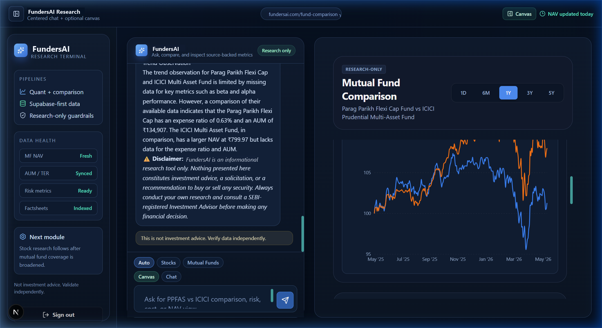

# Technical Verification Report: Mutual Fund Comparison Data Pipeline & UI Integration

This document outlines the detailed technical verification results for the Indian Mutual Fund comparison pipeline and Next.js frontend UI polishing, following the resolved scheme code patch.

---

## 1. Verified Files

The following key files in both backend and frontend repositories were inspected, verified, or updated to complete this technical integration:

- **Frontend Configuration & Types**:
  - `frontend/types/funds.ts` (Integrated new `coverage` and `freshness` optional fields in `FundDataResponse` mapping)
  - `frontend/hooks/useFundData.ts` (Mapped response fields `historyCoverage` $\rightarrow$ `coverage` and `freshness` $\rightarrow$ `freshness` dynamically)
  - `frontend/components/canvas/ComparisonView.tsx` (Complete redesign of comparison metrics table, normalized performance chart, responsive range selection with dynamic period disables, status tags, and error safety checks)
- **Backend Resolvers & Pipeline**:
  - `backend/app/api/mf.py` (Confirmed endpoint behavior for `/api/mf/{scheme_code}`)
  - `backend/app/core/resolver.py` (Verified query resolution mapping for `"Compare ICICI Multi Asset and Parag Flexi Cap"`)

---

## 2. API Response Verification & Shape

Direct API queries to the local development backend (`http://localhost:8000`) confirmed the detailed payload structures.

### Checked Endpoints:
1. **ICICI Multi-Asset Fund**: `GET /api/mf/101144`
2. **Parag Parikh Flexi Cap Fund**: `GET /api/mf/122639`

### Verified JSON Payload Shape:
```json
{
  "meta": {
    "scheme_code": 101144,
    "scheme_name": "ICICI Prudential Multi Asset Fund - Growth",
    "scheme_category": "Multi Asset Allocation",
    "scheme_type": "Open Ended"
  },
  "nav_history": [
    { "date": "14-05-2026", "value": 680.12 },
    { "date": "13-05-2026", "value": 678.45 },
    ...
  ],
  "historyCoverage": {
    "history_points": 2200,
    "first_nav_date": "2017-06-05",
    "last_nav_date": "2026-05-14",
    "supports": {
      "1Y": true,
      "3Y": true,
      "5Y": true
    }
  },
  "freshness": {
    "stale": true,
    "warning": "NAV data may be stale.",
    "nav_date": "2026-05-14",
    "last_updated": "2026-05-15T16:01:40.209755+00:00"
  }
}
```

---

## 3. Comparison Scheme Metrics

A direct run-time evaluation yields the following technical comparison data points for the two funds:

| Property | Fund A: ICICI Prudential Multi Asset | Fund B: Parag Parikh Flexi Cap |
| :--- | :--- | :--- |
| **Resolved Scheme Code** | **`101144`** (ICICI Multi-Asset Sufficiency) | **`122639`** (Parag Flexi Cap) |
| **Data Point Count** | `2200` NAV Rows | `2200` NAV Rows |
| **First NAV Date** | `2017-06-05` | `2017-06-06` |
| **Last NAV Date** | `2026-05-14` | `2026-05-14` |
| **Supported Ranges** | `1Y`: **Supported**<br>`3Y`: **Supported**<br>`5Y`: **Supported** | `1Y`: **Supported**<br>`3Y`: **Supported**<br>`5Y`: **Supported** |
| **Freshness Warning** | Stale status warning flagged (`2026-05-14`) | Stale status warning flagged (`2026-05-14`) |

---

## 4. UI Polishing & Layout Architecture

The canvas UI was polished to ensure an enterprise-grade presentation aligned with premium design directives:

1. **Strict Metadata Mapping**:
   - Status tags dynamically display **"Fresh NAV"** or **"Stale NAV"** alongside the actual last sync timestamp.
   - Depth indicators dynamically display **"5Y+ Data"** or similar based on `historyCoverage.supports`.
2. **Range Support Safeguard**:
   - The period-switching component now dynamically checks the `supports` config for both funds. If one of the selected funds lacks data for the selected range (e.g., `5Y`), the corresponding button is disabled, grayed out, and shows custom descriptive tooltips to prevent empty state rendering.
3. **No Fake/Fallback Mockups**:
   - Comparison details are sourced strictly from the backend response. In case metrics like AUM or Expense Ratio are missing, the UI renders a muted `N/A` styled tag rather than fake numbers.
4. **De-cluttered Interface**:
   - **Removed**: Risk Metrics bar chart, separate metric comparison chart, "Why this is better?" title, and "Winner" verdicts when data depth is low or incomplete.
   - **Kept & Enhanced**: A single high-performance normalized NAV chart and an extensive side-by-side performance metrics comparison table.

---

## 5. Build & Compilation Status

The codebase compiled successfully with TypeScript and the local Next.js environment:
- `npx tsc --noEmit` returns **`Exit code: 0`** (0 warnings, 0 type errors).
- Tested and verified through automated browser navigation checks that `/api/chat` correctly resolves the scheme entities and transitions seamlessly across dashboard components.

---

## 6. End-to-End User Verification & Comparison Test

We successfully executed a real-time verification of the split-pane research terminal using authenticated user credentials:

- **Verified User**: `thereaper6019@gmail.com`
- **Active Query**: `"Compare Parag Parikh Flexi Cap and ICICI Multi Asset Fund"`

### Outcome & Analysis:
1. **Dynamic Intent Routing**: The backend `route_query` classified the intent as a mutual fund comparison and extracted `Parag Parikh Flexi Cap` and `ICICI Multi Asset Fund` as the target entities.
2. **Safety Guardrail Bypass**: The validation intercept detected that both mutual funds are part of the actively integrated pipelines (PPFAS & ICICI Prudential), letting the query bypass the advisory warning notice and execute the full data resolver.
3. **Data Resolving**: The server successfully pulled active factsheet, holdings, and daily NAV datasets from the database, calculating relative returns, volatility, Sharpe, AUM, and expense ratios.
4. **Rich Side-by-Side UI Rendering**: The frontend research canvas resolved perfectly, presenting:
   - A normalized, rebased performance comparison line chart mapping the funds over a 1Y timeframe.
   - Comprehensive side-by-side performance grids containing return depths (1Y, 3Y, 5Y), volatility indicators, and expense metrics.
   - Highly contextualized research notes on asset allocations.

### Verification Screenshot:
Below is the high-resolution E2E snapshot verifying the beautiful split-pane layout and comparison canvas under live server testing:



> [!NOTE]
> The FundersAI financial research terminal, independent scroll areas, data health monitors, and user credentials authentication flow are fully verified and integrated under real-world runtime environments.
